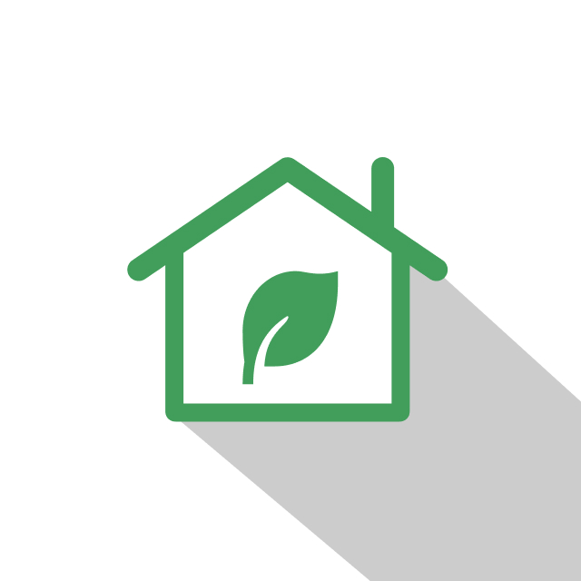
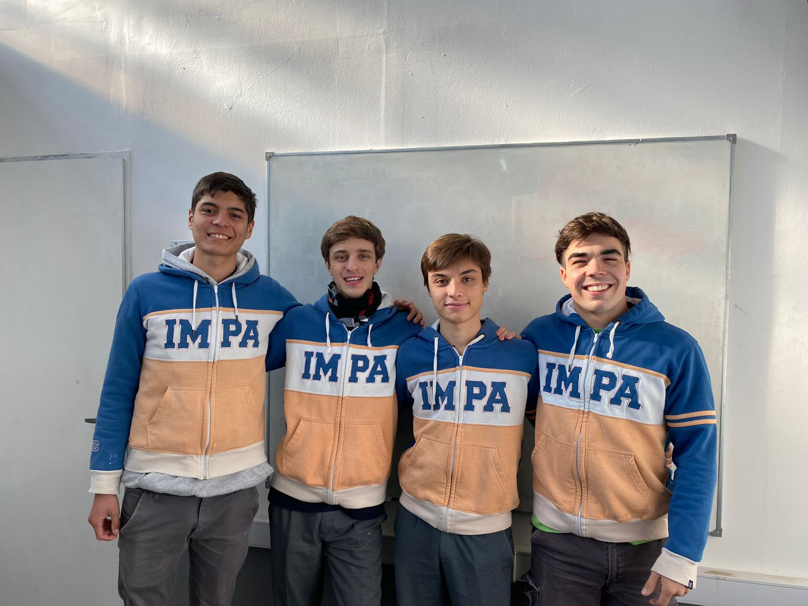

# Greenhouse

## Qué es y cuál es su fin?

Greenhouse es un invernadero inteligente cuya función es controlar parámetros de las plantas mediante sensores de humedad, luz, temperatura, entre otros. Todo esto es para la producción de alimentos de manera sustentable dentro del mismo.

## Quiénes lo desarrollan?
Greenhouse es un proyecto en proceso realizado por alumnos de la Escuela Secundaria IMPA de 7mo 2da Avionica.

## Integrantes

### Uriel Benitez
    📷 Instagram: urielbenitezz
    📧 Email: unbenitez@gmail.com
### Mateo Gonzalez Pautaso
    📷 Instagram: mate.gp
    📧 Email: mateogonzalezpautaso@gmail.com
### Iván Michalina
    📷 Instagram: ivan_michalina
    📧 Email: imichalina@icloud.com
### Juan Martín Sanchez
    📷 Instagram: juansnchez_
    📧 Email: juan.snchez03@gmail.com

## Cómo contactarnos
Si tenes opiniones o dudas sobre el proyecto que nos puedan ayudar, no dudes en ponerte en contacto con nosotros:

    📧 Email: greenhouse.impa@gmail.com
    🌐 Página Web: https://projectgreenhouse.github.io/
    📷 Instagram: @greenhouse.impa
    🗞️ LinkedIn: https://www.linkedin.com/company/green-houseimpa/about/
